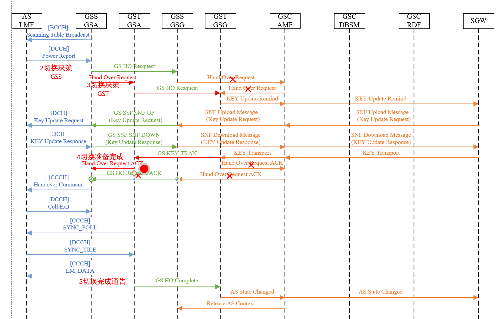
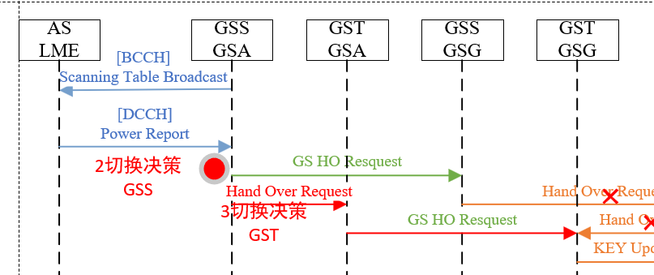
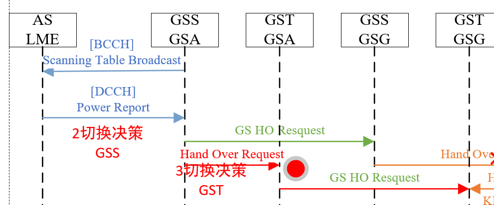
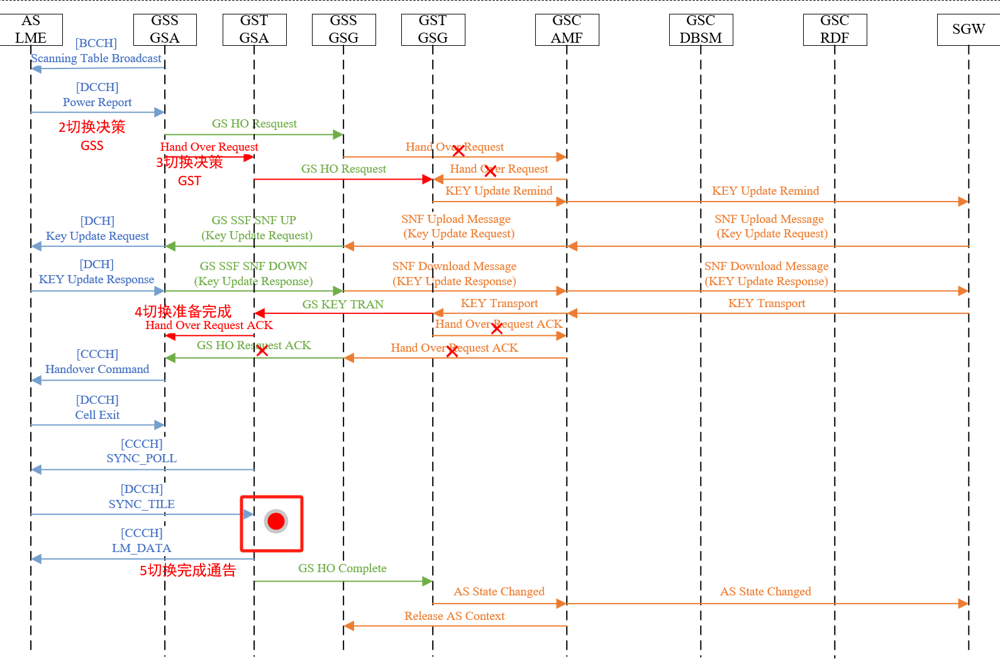

# Libldcauc SNF / SNP-Sub 层接口文档 V1.1.0

[](https://www.gnu.org/licenses/gpl-3.0)

## 概述

本项目提供网络功能层(SNF)的核心接口，用于不同角色（AS/GS/SGW）的初始化、安全通信及数据处理。主要功能包括SNF层初始化、认证流程、数据加密/解密、完整性校验等。

其中，库中所定义的安全网关角色（SGW）仅作测试用，测试过程中使用的安全网关详见ldacs-combine项目。

---

## 功能特性

- 多角色支持：初始化和管理AS、GS、SGW实体的SNF层。
- 安全协议：支持AES加密/解密及多种HMAC算法（MAC长度64/96/128/256位）。
- 切换处理：实现基站间切换（Handover）的协调与响应。
- 回调机制：通过回调函数处理认证完成、数据传输、注册失败等事件。
- 随机数生成：生成至多64位的安全随机数。

---

## 安装

⚠️ **注意**：本项目要求 CMake 最低版本为 **3.20**。如果构建失败，请先检查 CMake 版本！

⚠️ **注意**：在执行apt upgrade之前需要***谨慎评估环境中其他项目依赖的升级影响***，若影响巨大应手动安装本项目所有依赖！

### 依赖安装

本项目依赖多个外部库以及内部项目，须按如下顺序安装依赖。

#### 1. 安装libyaml、libevent、uthash、libsqlite3、uuid (Ubuntu)

```shell
sudo apt update && sudo apt upgrade
sudo apt install libyaml-dev libevent-dev uthash-dev libsqlite3-dev uuid-dev
```

#### 2. 拉取并安装base64 及 cjson

cjson不可以使用apt默认版本，依赖版本：v1.7.18及以上

```shell
#base64
git clone https://github.com/aklomp/base64.git
cd base64 && mkdir build && cd build
cmake ..
make -j12 && sudo make install

#cjson
git clone https://github.com/DaveGamble/cJSON
cd cJSON && mkdir build && cd build
cmake ..
make -j12 && sudo make install
```

#### 3. 安装密码卡驱动和库文件

- **对于尚未使用密码卡的环境**

```shell
git clone https://github.com/thirdxiaozhu/GmSSL-liteldacs
cd GmSSL-liteldacs && mkdir build && cd build
cmake .. && make -j12 && sudo make install
```

- **对于AS、GS设备**

使用piico-manager密码卡工具安装驱动及依赖库

```shell
git clone xxxx
```

- **对于SGW设备**

请直接使用提供的网关工控机

#### 4. 安装libliteldacscrypto

```shell
git clone https://github.com/liteldacs/liteldacscrypto.git
cd liteldacscrypto && mkdir build && cd build
cmake .. && make -j12 && sudo make install
```

根据环境设置选项

- **对于尚未使用密码卡的设备**

```shell
cmake ..
```

- **对于AS设备**

```shell
cmake .. -DAS_DEVICE=ON
```

- **对于GS设备**

```shell
cmake .. -DGS_DEVICE=ON
```

- **对于SGW设备**

```shell
cmake .. -DSGW_DEVICE=ON
```

编译并安装

```shell
make -j12 & sudo make install
```

#### 5. 安装libliteldacssdk

```shell
git clone https://github.com/liteldacs/liteldacssdk.git
cd liteldacssdk && mkdir build && cd build
cmake .. && make -j12 && sudo make install
```

### 安装本项目

```shell
git clone https://github.com/liteldacs/libldcauc.git
cd libldcauc && mkdir build && cd build
cmake ..  //这里需要添加和libliteldacscrypto中一致的选项
make -j12 && sudo make install
```

---

## 返回码定义

| 宏定义                     | 值  | 说明     |
|-------------------------|----|--------|
| `LDCAUC_OK`             | 0  | 操作成功   |
| `LDCAUC_FAIL`           | -1 | 通用失败   |
| `LDCAUC_WRONG_PARA`     | -2 | 参数错误   |
| `LDCAUC_NULL`           | -3 | 空指针异常  |
| `LDCAUC_INTERNAL_ERROR` | -4 | 内部逻辑错误 |

---

## 角色定义

| 角色宏        | 值 | 说明             |
|------------|---|----------------|
| `ROLE_AS`  | 1 | 飞机站 (Aircraft) |
| `ROLE_GS`  | 2 | 地面站 (Ground)   |
| `ROLE_SGW` | 4 | 安全网关 (Gateway) |

---

## 安全算法配置

### MAC 长度枚举（SNP SEC字段）

```c
enum SEC_ALG_MACLEN {
    SEC_MACLEN_INVAILD = 0x0,  // 无效长度
    SEC_MACLEN_96      = 0x1,  // 96 位 (12 字节)
    SEC_MACLEN_128     = 0x2,  // 128 位 (16 字节)
    SEC_MACLEN_64      = 0x3,  // 64 位 (8 字节)
    SEC_MACLEN_256     = 0x4   // 256 位 (32 字节)
};
```

### MAC 长度转换宏

```c
// 根据枚举值返回实际字节长度，无效值返回0
int maclen = get_sec_maclen(SEC_MACLEN_96); // 返回12
```

---

## 回调函数

### 1. `finish_auth` - 认证完成回调

```c
int8_t (*finish_auth)();
```

#### 功能描述

- **用途**：由 **AS** 调用，标识认证流程完成。
- **需包含功能**：
    - 将 LME状态更新为 `LME_OPEN`。

#### 调用时机

- 当 AS 完成认证后触发。

#### 实现样例

```c++
int8_t as_finish_auth_func() {
    //AS LME 转换状态为OPEN
    change_LME_OPEN();
    ...
    return LDACS_OK;
}
```

### 2. `trans_snp` - SNP 数据传输回调

```c
int8_t (*trans_snp)(uint16_t AS_SAC, uint16_t GS_SAC, uint8_t *buf, size_t buf_len);
```

#### 功能描述

- **用途**：由 **AS/GS** 调用，向 SNP 层传递数据。
- **参数说明**：
    - `AS_SAC`：发送/接收数据的 AS 对应的 SAC。
    - `GS_SAC`：关联的 GS 对应的SAC。
    - `buf`：待传输的数据缓冲区指针。
    - `buf_len`：数据长度（字节数）。

#### 调用场景

- AS/GS SNF 需将协议数据单元（PDU）传递至 SNP 层时调用。

#### 实现样例

```c++
int8_t trans_snp_data(uint16_t AS_SAC, uint16_t GS_SAC, uint8_t *buf, size_t buf_len) {
    orient_sdu_t *orient_sdu = create_orient_sdus(AS_SAC, GS_SAC);

    /* 通过原语向SNP层传递对应报文 */
    CLONE_TO_CHUNK(*orient_sdu->buf, buf, buf_len);
    preempt_prim(&SN_DATA_REQ_PRIM, SN_TYP_FROM_LME, orient_sdu, free_orient_sdus, 0, 0);
    return LDACS_OK;
}
```

### 3. `register_snf_fail` - 注册失败回调

```c
int8_t (*register_snf_fail)(uint16_t AS_SAC);
```

#### 功能描述

- **用途**：由 **AS/GS** 调用，处理服务注册失败事件。
- **应包含功能**：
    - 清理与失败 AS 关联的 LME 和 DLS 实体资源。
- **参数说明**：
    - `AS_SAC`：注册失败的 AS 服务接入点标识符。

#### 调用场景

- SNF注册失败时触发。

#### 实现样例

```c++
int8_t register_snf_failed(uint16_t AS_SAC) {
    if (config.role == LD_AS) {
        ...
    } else {
        //删除AS_SAC对应的LME实体
        delete_lme_as_node_by_sac(AS_SAC, clear_as_man);
    }
    return LD_OK;
}
```

### 4. `gst_ho_complete_key` - 切换过程，目的GS完成密钥更新后的回调

```c
int8_t (*gst_ho_complete_key)(uint16_t AS_SAC, uint32_t AS_UA, uint16_t GSS_SAC);
```

#### 功能描述

- **用途**：由 **GS** 调用，标识切换流程完成。
- **应包含功能**：
    - 向源基站（GS Source）发送切换确认（ACK）。
- **参数说明**：
    - `AS_SAC`：发生切换的 AS SAC。
    - `AS_UA`：发生切换的 AS GS。
    - `GSS_SAC`：切换前的源 GS SAC。

#### 调用场景

- 当目标 GS 完成切换过程的密钥协商后触发。

#### 调用位置



#### 实现样例

```c++
int8_t gst_handover_complete_key(uint16_t AS_SAC, uint32_t AS_UA, uint16_t GSS_SAC) {
    peer_propt_t *peer = get_peer_propt(GSS_SAC);
    if (!peer) return LD_ERR_INTERNAL;

    uint16_t next_co = get_CO();
    
    //向源GS发送切换准备完成消息
    ...

    //初始化正在切换的AS的LME实体
    if (has_lme_as_enode(AS_SAC) == FALSE) {
        set_lme_as_enode(init_as_man(AS_SAC, AS_UA, lme_layer_objs.GS_SAC));
    }
    //初始化正在切换的AS的DLS
    set_dls_enode(lme_layer_objs.GS_SAC, AS_SAC);
    //分配CO
    set_mac_CO(next_co, AS_SAC);

    //准备发送SYNC_POLL
    to_sync_poll_t *to_sync = calloc(1, sizeof(to_sync_poll_t));
    to_sync->SAC = AS_SAC;
    list_add_tail(&to_sync->lpointer, lme_layer_objs.to_sync_head);

    return LDCAUC_OK;
}
```

---

## 核心接口

### 1. 初始化函数

#### AS 初始化

```c
void init_as_snf_layer(finish_auth finish_auth, trans_snp trans_snp, register_snf_fail register_fail);
```

- **参数**: (见“回调函数”部分)

#### GS 初始化

```c
void init_gs_snf_layer_unmerged(uint16_t GS_SAC, const char *gsnf_addr, uint16_t gsnf_port, trans_snp trans_snp,
                                register_snf_fail register_fail);
```

- **参数**:
    - `GS_SAC`:    地面站 SAC 标识
    - `gsnf_addr`: GSC/网关的 IPv6 地址
    - `gsnf_port`: 网关端口
    - (见“回调函数”部分)

- **使用样例**：

样例文件：src/layer/lme/lme.c

```c 
// 初始化LME层
l_err make_lme_layer() {
    switch (config.role) {
        case LD_AS:
        case LD_GS: {
            switch (config.role) {
                case LD_AS: {
                    init_lme_fsm(&lme_layer_objs, LME_FSCANNING);
                    lme_layer_objs.lme_as_man = init_as_man(DEFAULT_SAC, config.UA, DEFAULT_SAC);
                    
                    // 调用AS SNF 初始化函数
                    init_as_snf_layer(as_finish_auth_func, trans_snp_data, register_snf_failed);
                    
                    break;
                }
                case LD_GS: {
                    ...
                    init_gs_snf_layer_unmerged(config.GS_SAC, config.gsnf_addr, config.gsnf_remote_port,
                                                     config.gsnf_local_port,
                                                     trans_snp_data, register_snf_failed, gst_handover_complete_key);

                    init_lme_fsm(&lme_layer_objs, LME_OPEN);

                    ...
                    break;
                }
                default: {
                    break;
                }
            }
            init_lme_mms(&lme_layer_objs);
            init_lme_rms(&lme_layer_objs);
            break;
        }
        ...
    }
    return LD_OK;
}
```

### 2. 资源释放

```c
int8_t destory_snf_layer(); 
```

- **调用场景**：
  程序结束时

### 3. 安全认证流程

#### 触发 AS 认证

```c
int8_t snf_LME_AUTH(uint8_t role, uint16_t AS_SAC, uint32_t AS_UA, uint16_t GS_SAC);
```

- **调用场景**：
  AS LME進入LME_AUTH状态后
- **参数**:
    - `role`:   角色（需为 `ROLE_AS`）
    - `AS_SAC`: 飞机 SAC
    - `AS_UA`:  飞机 UA
    - `GS_SAC`: 目标地面站 SAC
- **使用样例**

样例文件：src/layer/lme/lme.c

```c
l_err entry_LME_AUTH(void *args) {
    l_err err;

    do {
        //change MAC state into MAC_AUTH
        //change SNP state into SNP_AUTH
        // Tell RCU the state of LME is AUTH 
        ...

        if (snf_LME_AUTH(
                config.role,
                lme_layer_objs.lme_as_man->AS_SAC,
                lme_layer_objs.lme_as_man->AS_UA,
                lme_layer_objs.lme_as_man->AS_CURR_GS_SAC
            ) != LDCAUC_OK) {
            err = LD_ERR_INTERNAL;
        }
    } while (0);
    return err;
}
```

### 4. 注册SNF实体

```c
int8_t register_snf_en(uint8_t role, uint16_t AS_SAC, uint32_t AS_UA, uint16_t GS_SAC);
```

- **调用场景**：
  在GS从RA信道接收到Cell Response后注册AS实体

- **参数**:
    - `role`:   角色（必须传入枚举值 `ROLE_GS`）
    - `AS_SAC`: 飞机 SAC
    - `AS_UA`:  飞机 UA
    - `GS_SAC`: 目标地面站 SAC
- **使用样例**

样例文件：src/layer/lme/lme_mms.c

```c++
void M_SAPR_cb(ld_prim_t *prim) {
    if (prim->prim_seq == MAC_RACH_IND) {
        switch (prim->prim_obj_typ) {
        //判断是否为CELL REQUEST
            case R_TYP_CR: {
                ra_cell_rqst_t *cr = data_struct;
                //初始化当前AS的LME实体
                if (has_lme_as_enode(sac) == FALSE) {
                    set_lme_as_enode(init_as_man(sac, cr->UA, lme_layer_objs.GS_SAC));
                }
                //使用本接口，初始化AS的SNF实体
                if(register_snf_en(LD_GS, sac, cr->UA, lme_layer_objs.GS_SAC) != LDCAUC_OK){
                    log_warn("Can not register snf");
                    break;
                }
                //DLS OPEN
                ...
        }
        ...  
    } 
    ...
}
```

### 5. 注销SNF实体

```c
int8_t unregister_snf_en(uint16_t AS_SAC);
```

- **调用场景**：
  AS注销时，由GS LME调用

- **参数**:
    - `AS_SAC`: 飞机 SAC

### 6. 将控制数据上传给SNF处理

```c
int8_t upload_snf(bool is_valid, uint16_t AS_SAC, uint16_t GS_SAC, uint8_t *snp_buf, size_t buf_len);
```

- **调用场景**：
  SNP上传控制数据时

- **参数**:
    - `is_valid`:   是否是合法报文
    - `AS_SAC`: 飞机 SAC
    - `GS_SAC`: 地面站 SAC
    - `snp_buf`: 上传SNF数据
    - `buf_len`: 数据长度
- **使用样例**

样例文件：src/layer/lme/lme.c

```c++
//写在了SN_SAPD接口里
void SN_SAPD_L_cb(ld_prim_t *prim) {
    switch (prim->prim_seq) {
        case SN_DATA_IND: {
            orient_sdu_t *osdu = prim->prim_objs;
            //调用位置， 根据角色自动判断数据传输方向
            upload_snf(prim->prim_obj_typ == VER_PASS, osdu->AS_SAC, osdu->GS_SAC, osdu->buf->ptr, osdu->buf->len);
            break;
        }
        default:
            break;
    }
}
```

### 7. 源GS切换触发

```c++
int8_t gss_handover_request_trigger(uint16_t AS_SAC, uint16_t GSS_SAC, uint16_t GST_SAC);
```

- **调用场景**：
  源GS向地面部分通告Handover请求

- **参数**:
    - `AS_SAC`: 飞机 SAC
    - `GSS_SAC`: 源地面站 SAC
    - `GST_SAC`: 目标地面站 SAC
- **使用位置**



### 8. 目标GS切换响应

```c
int8_t gst_handover_request_handle(uint16_t AS_SAC, uint32_t AS_UA, uint16_t GSS_SAC, uint16_t GST_SAC);
```

- **调用场景**：
  在目标GS接收到源GS的切换提醒时

- **参数**:
    - `AS_SAC`: 飞机 SAC
    - `AS_UA`: 飞机 UA
    - `GSS_SAC`: 源地面站 SAC
    - `GST_SAC`: 目标地面站 SAC
- **使用位置**



### 9. 目的GS完成切换

```c++
int8_t gst_handover_complete(uint16_t AS_SAC);
```

- **调用场景**：
  目的GS完成切换，向网关发送HO Complete

- **参数**:
    - `AS_SAC`: 飞机 SAC
    -
- **使用位置**



### 10. 生成随机数

```c
uint64_t generate_urand(size_t rand_bits_sz);
```

- **参数**:
    - `rand_bits_sz`: 生成随机数的比特长度，至多64位

### 11. 数据加密/解密

加密前对原始数据使用PKCS7进行填充，并在解密后取消填充

```c
int8_t snpsub_crypto(uint16_t AS_SAC, uint8_t *in, size_t in_len, 
                    uint8_t *out, size_t *out_len, bool is_encrypt);
```

- **方向**:
    - `is_encrypt=true`: 加密 `in` 到 `out`
    - `is_encrypt=false`: 解密 `in` 到 `out`
- **注意**:
    - `out` 缓冲区需由调用者预先分配

### 12. HMAC 计算与验证

```c
// 计算 HMAC
int8_t snpsub_calc_hmac(uint16_t AS_SAC, uint8_t SEC, 
                        uint8_t *in, size_t in_len, uint8_t *out, size_t *out_len);

// 验证 HMAC
int8_t snpsub_vfy_hmac(uint16_t AS_SAC, uint8_t SEC, uint8_t *snp_pdu, size_t pdu_len);
```

---

## 注意事项

1. **线程安全**: 接口未保证线程安全，需由调用者同步。
2. **内存管理**: `snp_buf`、`out` 等缓冲区需由调用者分配/释放。
3. **错误处理**: 需检查返回值，特别是 `LDCAUC_NULL` 和 `LDCAUC_WRONG_PARA`。
4. **角色限制**: `snf_LME_AUTH` 仅限 `ROLE_AS` 调用。

---

## 版本

- **保护版本**: `PROTECT_VERSION 1`
- **最后更新**: 2025/4/30

---

## 作者

中国民航大学新航行系统研究所


